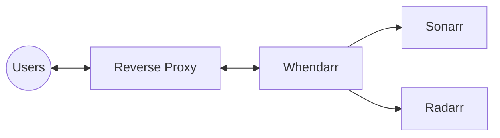

import { WorkInProgress } from '@/components/callouts.js';
import { Tabs } from 'nextra/components';

# Configuring a Reverse Proxy

<WorkInProgress />

The goal of using a reverse proxy is typically to allow for the generation of TLS/SSL certificates for your hosted services.
Whendarr fully supports `Traefik`, `Nginx`, `HAProxy` and more.



## Traefik

<Tabs items={['Sub-Domain', 'Path']}>
    <Tabs.Tab>
        ```yml
        services:
            whendarr:
                ...
                labels:
                    traefik.enable: true
                    traefik.http.routers.whendarr-rtr.rule: Host(`whendarr.domain.tld`)
                    traefik.http.routers.whendarr-rtr.service: whendarr-svc
                    traefik.http.services.whendarr-svc.loadbalancer.server.port: 3000
        ```
    </Tabs.Tab>
    <Tabs.Tab>
        ```yml
        services:
            whendarr:
                ...
                environment:
                    ...
                    BASE_PATH: /whendarr
                labels:
                    traefik.enable: true
                    traefik.http.routers.whendarr-rtr.rule: Host(`domain.tld`) && && PathPrefix(`/whendarr`)
                    traefik.http.routers.whendarr-rtr.service: whendarr-svc
                    traefik.http.services.whendarr-svc.loadbalancer.server.port: 3000
        ```
    </Tabs.Tab>
</Tabs>

## Nginx

<Tabs items={['Sub-Domain', 'Path']}>
    <Tabs.Tab>
        ```conf
        WIP
        ```
    </Tabs.Tab>
    <Tabs.Tab>
        ```conf
        WIP
        ```
    </Tabs.Tab>
</Tabs>