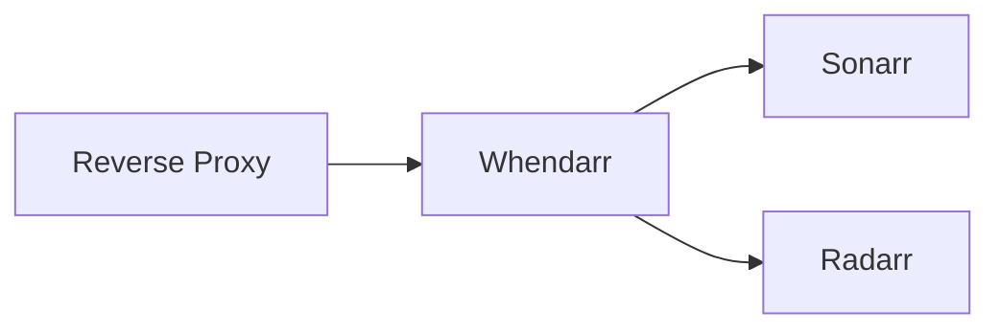

import { Tabs } from 'nextra/components'

# Configuring a Reverse Proxy



## Traefik

<Tabs items={['Sub-Domain', 'Path']}>
    <Tabs.Tab>
        ```yml
        services:
            whendarr:
                ...
                labels:
                    traefik.enable: true
                    traefik.http.routers.whendarr-rtr.rule: Host(`whendarr.domain.tld`)
                    traefik.http.routers.service: whendarr-svc
                    traefik.http.services.whendarr-svc.loadbalancer.server.port: 3000
        ```
    </Tabs.Tab>
    <Tabs.Tab>
        ```yml
        services:
            whendarr:
                ...
                labels:
                    traefik.enable: true
                    traefik.http.routers.whendarr-rtr.rule: Host(`domain.tld`) && && PathPrefix(`/whendarr`)
                    traefik.http.routers.service: whendarr-svc
                    traefik.http.services.whendarr-svc.loadbalancer.server.port: 3000
        ```
    </Tabs.Tab>
</Tabs>

## Nginx

<Tabs items={['Sub-Domain', 'Path']}>
    <Tabs.Tab>
        ```conf
        WIP
        ```
    </Tabs.Tab>
    <Tabs.Tab>
        ```conf
        WIP
        ```
    </Tabs.Tab>
</Tabs>