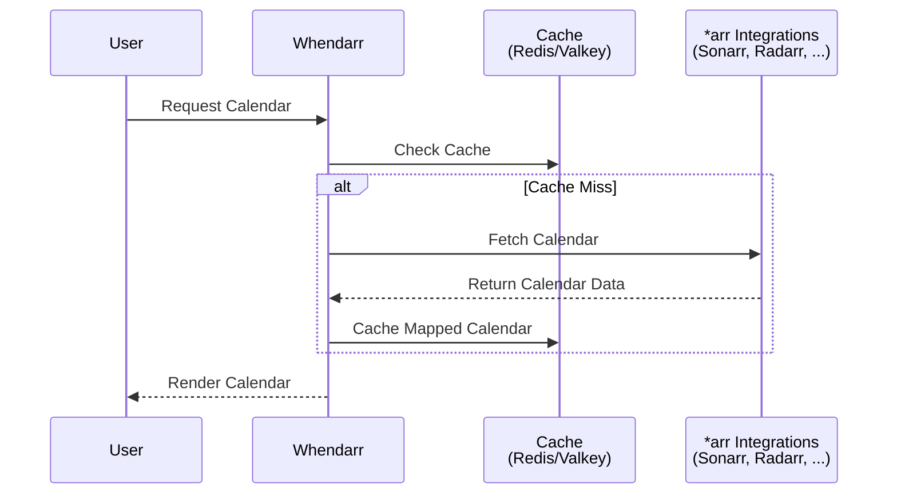

import { WorkInProgress } from '@/components/callouts.js';
import { Callout } from 'nextra/components';

# Getting Started

<WorkInProgress />

Whendarr is created in a way to be simple to use, but it's also important to be
transparent about how it works under the hood. This page documents the data flow and
API calls that make the calendar work. This helps you know exactly what Whendarr is
doing on your behalf, what services it talks to, and when.

Because Whendarr sits between your browser and your private \*arr stack, understanding
its behavior helps you, the server owner, make informed descisions about how you deploy
it. This is not a black box. Your media data stays on your infrastructure, Sonarr and
Radarr, never exposed to the wild open internet.

<Callout type={'important'}>
    Whendarr only ever reads, never writing back any data to your \*arr stack.
</Callout>

## Calendar Sequence

## Downstream API Endpoints

### Sonarr

View [Sonarr API](https://sonarr.tv/docs/api/#v3) Documentation

| Endpoint           | Purpose       | Parameters                      |
| ------------------ | ------------- | ------------------------------- |
| `/api/v3/health`   | Healthcheck   | None                            |
| `/api/v3/calendar` | Calendar Data | `start`, `end`, `includeSeries` |

### Radarr

View [Radarr API](https://radarr.video/docs/api/) Documentation

| Endpoint           | Purpose       | Parameters     |
| ------------------ | ------------- | -------------- |
| `/api/v3/health`   | Healthcheck   | None           |
| `/api/v3/calendar` | Calendar Data | `start`, `end` |

## Client-Side Caching

Whendarr uses [TanStack Query](https://tanstack.com/query/latest) (`@tanstack/react-query`) to manage client-side
data fetching and caching in the browser. Adding a second layer of caching in on top of server-side Redis/Valkey
caching. This means repeated navigation between already fetched months *should* feel near-instant without fetching
on each month navigation.

When you load the calendar, TanStack Query stores the response (in memory) for the duration of a session.  If you navigate
away and return, or switch between months you've already viewed, the data is served directly from the client cache. In the
background, TanStack Query will silently revalidate stale data and update the view if anything has changed.

This two-layer caching strategy means:

- Redis/Valkey protects your \*arr services from repeated server-side API calls across all users and sessions.
- TanStack Query protects the server from repeated browser requests within a single user's session.
